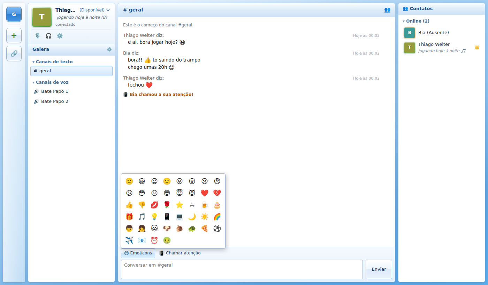

# StraightTalk

Chat de texto, voz e compartilhamento de tela ao mesmo tempo, com cara de mensageiro clássico e o mínimo de delay.

- **Visual de mensageiro clássico:** lista de contatos com status (Disponível, Ocupado, Ausente, Invisível), mensagem pessoal, "Fulano diz:", emoticons por atalho (`:)`, `(L)`, `(Y)`...), **chamar atenção** que treme a janela e sons de mensagem/contato online



- **Contas** com usuário e senha
- **Servidores** com convite por link, **canais de texto** (com histórico) e **canais de voz**
- **Voz** com indicador de quem fala, mudo, desativar áudio e volume por pessoa
- **Compartilhamento de tela** em modo Jogo (60 fps) ou Texto (nitidez), com áudio do sistema
- Escolha de microfone e saída de áudio, supressão de ruído
- **App para Windows** na pasta [`desktop/`](desktop/)

## Rodar no seu computador

Precisa do [Node.js](https://nodejs.org) 22.13 ou mais novo.

```bash
npm install
npm start
```

Abra http://localhost:3000, crie uma conta e um servidor. No Windows também dá para dar dois cliques em `iniciar.bat`.

Os dados ficam em `data/straighttalk.db` (SQLite). Faça backup desse arquivo.

## Como a voz e a tela funcionam

O app tem dois modos, escolhidos pelas variáveis de ambiente:

| Modo | Quando usar | O que configurar |
|---|---|---|
| **P2P** (padrão) | Grupos pequenos (até ~6 pessoas). Menor delay possível: a mídia vai direto entre as pessoas. | Nada. Para redes fechadas (4G, empresa, faculdade), adicione um TURN. |
| **LiveKit (SFU)** | Salas grandes, redes fechadas, qualidade adaptativa. Todos mandam a mídia uma vez para o servidor, que redistribui. | `LIVEKIT_URL`, `LIVEKIT_API_KEY`, `LIVEKIT_API_SECRET` |

### Variáveis de ambiente

| Variável | Para quê |
|---|---|
| `PORT` | Porta HTTP (padrão 3000) |
| `DB_FILE` | Caminho do banco (padrão `data/straighttalk.db`) |
| `LIVEKIT_URL` | Ex.: `wss://midia.seudominio.com`. Ativa o modo SFU. |
| `LIVEKIT_API_KEY` / `LIVEKIT_API_SECRET` | Chaves do servidor LiveKit |
| `TURN_URLS` | Só no modo P2P. Ex.: `turn:turn.seudominio.com:3478,turns:turn.seudominio.com:5349` |
| `TURN_SECRET` | Segredo do coturn (`use-auth-secret`). Gera credenciais temporárias por usuário. |
| `TURN_USERNAME` / `TURN_PASSWORD` | Alternativa ao `TURN_SECRET`, com credenciais fixas |
| `STUN_URLS` | Troca os servidores STUN padrão (Google) |
| `DATABASE_URL` / `DATABASE_AUTH_TOKEN` | Banco na nuvem (Turso, `libsql://...`). Sem isso, usa o arquivo local. |

## Hospedar

- **De graça:** Render + Turso + LiveKit Cloud. Passo a passo em [`deploy/GRATIS.md`](deploy/GRATIS.md).

  [](https://render.com/deploy?repo=https://github.com/thiagowelter2011-collab/straighttalk)

- **VPS própria** (menor delay, sem limite de minutos): app + LiveKit com TURN + HTTPS automático, em [`deploy/`](deploy/).

## Testes

```bash
npm test                                   # API: contas, servidores, canais, mensagens, voz, tokens
node test/e2e.js http://localhost:3000     # navegador: 3 pessoas, chat, voz e tela (precisa do Playwright)
```
